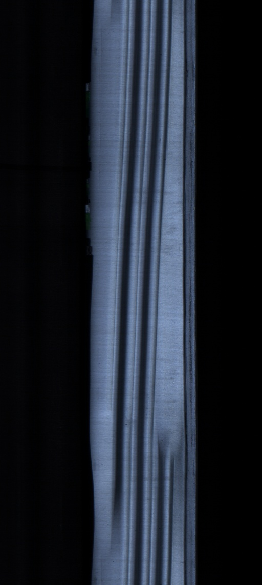

# アンタイトル

## ああああああ

あああ




  
かっこいい数式も書ける

$$
x+2=6
$$

* 項目に分けたり
* 2つめだよ
* 3つめ～

```text
class Hoge
{
public:
    Hoge();
    virtual ~Hoge();
    
private:
    

}
    
```



タブ分けてこんなん書ける



2つめのタブもこんな感じ




注意もこんな感じに書ける



